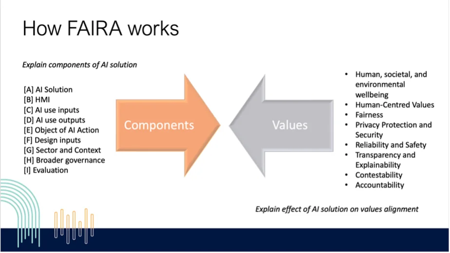
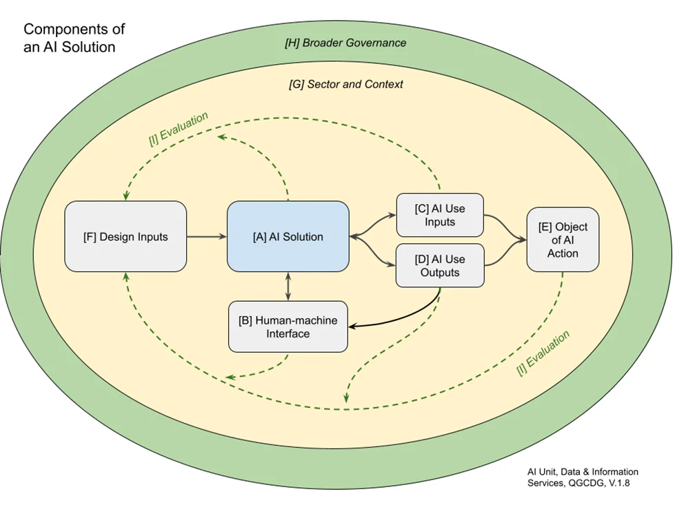

# Foundational Artificial Intelligence Risk Assessment Framework

> **⚠️ Important Notice:** This document was converted from DOCX to Markdown format using document conversion tools and is provided as a reference. While the content is derived from the official Queensland Government FAIRA Framework v1.0.0, this markdown version is not the official government document. For the authoritative version, please refer to the original document published by the Queensland Government.

**Version:** 1.0.0  
**Status:** Final  
**Date:** September 2024  
**Classification:** OFFICIAL - Public

---

## FAIRA Framework

### Name of Solution: [INSERT NAME HERE]

## Table of Contents

- [Contents](#contents)
- [Instructions](#instructions)
- [Background](#background)
- [How FAIRA Works](#how-faira-works)
- [Domains of AI Risk in the Queensland Government](#domains-of-ai-risk-in-the-queensland-government)
- [Part A - Components Analysis](#part-a---components-analysis)
- [Part B - Values Assessment](#part-b--values-assessment)
- [Part C - Controls for AI Risks](#part-c--controls-for-ai-risks)

## Contents

This framework includes:

- **Part A** - Components Analysis
- **Part B** - Values Assessment
- **Part C** - Controls for AI Risks

Completion of this framework will inform:

1. AI governance, compliance, and business processes

2. Risk identification and analysis

3. Controls and risk mitigations to be implemented / actioned.

4. Skills, development training and uplift

5. Communication and stakeholder engagement

6. Values and strategic alignment

## Instructions

Please be familiar with and refer to the AI governance policy and guideline when completing this framework. For further background and context it may also be helpful to refer to The National Framework for the Assurance of AI in Government (NFAAIG) 2024.

Each question in the framework is populated with guidance which should be deleted when finalised.

The FAIRA should be completed by a team of experts including technical, policy, subject domain specialists, operational experts, and accountable officers.

A team should plan a series of collaborative workshops to fill out a FAIRA and expect to reach out to additional experts depending on risks identified or required subject matter expertise.

Because it requires expertise from multiple AI risk domains (see Table 1) the team may find it easier to work through sections of Part A and Part B in parallel as answers to Part A will inform Part B and vice versa.

Part C is not a template requiring completion, but provides information that can assist with Parts A and B.

Some of the questions may be challenging to answer due to:

the complexity and opacity of components of many AI solutions available for government use,

the diversity of skills required of human operators, and

the variety of emergent risks from using AI in different contexts.

Knowledge gaps should be highlighted and communicated to decision makers so that appropriate risk controls can be implemented.

Please keep in mind this framework is not intended to replace existing ICT governance and risk management processes, but instead should support efforts to govern AI across all risk domains.

## Background

Government agencies managing the lifecycle of an AI system should use the Foundational AI risk assessment (FAIRA) as a communication tool for governance, risk, and assurance activities with stakeholders. Agencies should use FAIRA to identify risks specific to AI solutions as supplementary inputs to any existing assessment frameworks and activities, such as privacy impact assessments, information security assessments, human rights impact assessments and so on, that inform existing risk management activities. Aligned to the NFFAIG, the FAIRA framework promotes a common approach to identifying, evaluating, communicating, and managing risks associated with AI in the Queensland Government. The framework can assist agencies with meeting their mandated requirement to have a consistent and evidence-based process for AI evaluation under the AI governance policy. For further information on what agencies must do regarding the governance of AI, please see the AI Governance Policy.

The FAIRA framework is a transparency, accountability, and risk identification tool for Queensland Government agencies evaluating artificial intelligence (AI) solutions. The FAIRA aims to help stakeholders identify risks and potential mitigation actions specific to the AI lifecycle. FAIRA is ‘foundational’ because stakeholders can use it to describe an AI solution in terms of technical components, system design, human interaction, implementation, and their associated impacts to provide foundations for management action in existing risk processes. A list of common controls is also provided to assist teams with identification of actions that could be taken to reduce risk resulting from the FAIRA. Teams can use FAIRA as the basis for communicating additional AI risks and mitigations with stakeholders and as a springboard into other evaluation frameworks such as privacy or human rights. FAIRA can improve the requirements, implementation, and operation of an AI solution and in doing so strengthen public trust in how Government manages the AI lifecycle.

## How FAIRA Works

The FAIRA consists of a components analysis and values assessment (see Figure 1). The components analysis ensures that the AI solution is fully described within its intended context of use. The values assessment ensures that the benefits and risks of the AI solution within its context of use are identified so that risks can be managed through normal ICT risk register aligned to the NFAAIG.

### Figure 1: How FAIRA Works

A FAIRA should be initiated at the earliest opportunity when an AI solution is under consideration and throughout its lifecycle. Stakeholder consultation should be conducted and answers to any remaining gaps should be sought from relevant subject matter experts (see Table 1: Domains of AI Risk).

It is necessary to identify the boundaries/scope of the AI solution (e.g.- what it contains and what it entails, integration points with associated upstream and downstream systems). It is also important to ensure that the context identifies what is NOT part of the scope of the evaluation.

## Domains of AI Risk in the Queensland Government

AI intersects with many domains of risk. Table 1 provides twelve examples of domains of AI risk that an agency could consider. In preparing a FAIRA, teams can seek assistance on risks in domains unfamiliar to them by:

referring to their own internal agency subject matter experts for the domain (such as Privacy or Human Rights officers)

refer to guidelines that support best practice implementation of legislation relevant to the domain (such as Privacy Impact or Human Rights Impact assessments)

Engage directly with statutory officer holders or departments for further guidance and advice.

Table 1: Domains of AI risk within the Queensland Government

## Part A - Components analysis

To evaluate an AI solution, agency teams need to consider its constituent components (see Figure 2). By describing the components of an AI solution, stakeholders will establish the scope for design, building, using, evaluating, and controlling AI products systematically, responsibly, and safely. Answering the questions in the components analysis below provides information about the components of the AI Solution as it will be deployed within a particular context of use. The components of an AI solution should inform a values assessment to identify all relevant value misalignments that could constitute risks.

### Figure 2: Components of an AI Solution

## Table 1: AI solution

The AI solution is the installed software comprising of digital assets, use of cloud servers, APIs, databases, data used within the software, algorithms, models and integration within the digital ecosystem of an organisation.

## Table 2: Human machine interface

The human-machine interface is the means by which the operations of the AI solution communicates with human programmers, operators, system administrators and end users; and how humans interact with the AI solution including what they perceive its operations and how they manipulate the software.

## Table 3: AI use inputs

The AI use inputs are data fed into the AI solution at a particular place and time. Inputs can come from the environment through sensors, such as the way autonomous cars navigation systems use lidar data to optimise collision avoidance. Inputs can come from sensors connected to humans, such as monitoring the vital signs of patients in hospitals. Input can also come from commands from humans such as prompts to generative AI tools

## Table 4: AI use outputs

The AI use outputs are the data produced by the AI solution. Outputs might be recommendations represented by text, list, map or diagram. Outputs may be configured to trigger other actions.

## Table 5: Object of AI action

The object of AI action will be those who are affected by AI. The object of an AI action could include government employees, government decision makers and members of the public.

## Table 6: Design inputs

Design Inputs are the constraints on the AI solution including values, requirements, and controls. Design inputs will be continuously updated to manage changing risks captured through ongoing evaluation.

## Table 7: Sector and context

Sector and context captures domain-specific risks, guidance and requirements for the AI solution for its deployment in a specific context of operations.

## Table 8: Broader governance

Broader governance includes those considerations of laws and regulations outside of the AI guidance and technical implementation that might control its use.

## Table 9: Monitoring and evaluation

## Part B- Values assessment

Once the AI solution is described through the components analysis, a values assessment of the system should be performed. The values assessment is based upon Australia’s AI Ethics Principles set out in the NFAAIG, for which the Queensland Government is a signatory.

Once the AI solution is described through the components analysis (Part A), a values assessment should be performed. The values assessment is based upon each of Australia’s AI Ethics Principles (Table 2) as detailed in the NFAAIG.

Table 2: NFAAIG (2024)

## Using the controls

The controls listed in Part C of the framework can assist with the completion of the values assessment, as they can be utilised to mitigate the risks identified across each of the values. See part C for more guidance on how to apply controls.

## Part c- Controls for AI risks

To assist teams with understanding relevant actions that can be taken to mitigate risks identified using FAIRA, a multi-dimensional table of controls is provided below. This table details the kinds of controls that an agency can adopt to mitigate risks of negative impacts and harms. The high-level controls are a starting point for agencies. Specific controls, suitable to the risks identified by an agency, should be derived from the high-level controls described. Implementing these controls promotes a standardised way to address risks and promotes a culture of responsibility and trustworthiness in the deployment of AI systems across Queensland Government.

## Licence

This work is licensed under a Creative Commons Attribution 4.0 International licence. To view the terms of this licence, visit <http://creativecommons.org/licenses/by/4.0/>. For permissions beyond the scope of this licence, contact <qgea@qld.gov.au>.

To attribute this material, cite the Queensland Government Customer and Digital Group, Department of Transport and Main Roads.

The licence does not apply to any branding or images.

## Copyright

Foundational artificial intelligence risk assessment framework

© The State of Queensland (Department of Transport and Main Roads) 2024

## Document History

| Lead (name and contact details)   |     |
| --------------------------------- | --- |
| Contributors (names, departments) |     |
| Total time taken (hrs)            |     |
| Time period (dates)               |     |

| Version | Date | Description | Owner |
| ------- | ---- | ----------- | ----- |
|         |      |             |       |
|         |      |             |       |

| Domain                                            | Key position                                                                                                                                  | Agency, department or statutory body                                                                                                                                                                 | Relevant legislation and policy                                                                                                                                                                                                                                                                         |
| ------------------------------------------------- | --------------------------------------------------------------------------------------------------------------------------------------------- | ---------------------------------------------------------------------------------------------------------------------------------------------------------------------------------------------------- | ------------------------------------------------------------------------------------------------------------------------------------------------------------------------------------------------------------------------------------------------------------------------------------------------------- |
| Public Sector Values, Ethics, and Code of Conduct | Public Sector Commissioner                                                                                                                    | Public Sector Commission                                                                                                                                                                             | Public Sector Act 2022, Public Sector Ethics Act 1994, Inclusion and diversity strategy 2021-2025, Integrity Act 2029                                                                                                                                                                                   |
| Special Commissioner, Equity and Diversity        | Special Commissioner, Equity and Diversity                                                                                                    | Office of the Special Commissioner, Equity and Diversity                                                                                                                                             |                                                                                                                                                                                                                                                                                                         |
| Integrity Commissioner                            | Integrity Commissioner                                                                                                                        |                                                                                                                                                                                                      |                                                                                                                                                                                                                                                                                                         |
| Human rights                                      | Attorney-General                                                                                                                              | Department of Justice and Attorney-General                                                                                                                                                           | Human Rights Act (2019)                                                                                                                                                                                                                                                                                 |
| Workplace health and safety                       | Industrial Relations Commissioner                                                                                                             | Office of Industrial Relations                                                                                                                                                                       | Work Health and Safety Act 2011                                                                                                                                                                                                                                                                         |
| Environment and sustainability                    | Deputy-Director General Climate                                                                                                               | Department of Energy and Climate                                                                                                                                                                     | Environmental Protection Act 1994                                                                                                                                                                                                                                                                       |
| Public records and right to information           | State Archivist, Chief Customer & Digital Officer, Special Commissioner, Equity and Diversity, Queensland Ombudsman, Information Commissioner | State Archives, Queensland Government Customer & Digital Group, Office of the Special Commissioner, Equity and Diversity, Office of the Queensland Ombudsman, Office of the Information Commissioner | Public Records Act 2002, Records Governance Policy (2019), Generative Artificial Intelligence records 2024, Guideline on creating and keeping records for the proactive protection of vulnerable persons (2020), Ombudsman Act 2001, Public Interest Disclosure Act 2010, Right to Information Act 2009 |
| Data and Information Management                   | Chief Customer & Digital Officer                                                                                                              | Queensland Government Customer & Digital Group                                                                                                                                                       | QGEA Information management policy framework (2017) and associated policy documents. Crown IP, Use of Generative AI in the Queensland Government                                                                                                                                                        |
| Information Privacy                               | Information Commissioner                                                                                                                      | Office of the Information Commissioner                                                                                                                                                               | Information Privacy Act 2009 (Qld), Information Privacy Act 1988 (Cwlth)                                                                                                                                                                                                                                |
| Information Security                              | Chief Customer & Digital Officer                                                                                                              | Queensland Government Customer & Digital Group                                                                                                                                                       | Information security policy (IS18) and associated policy documents. Inter-jurisdictional legislation and policies such as GDPR                                                                                                                                                                          |
| Procurement                                       | Queensland Government Chief Procurement Officer, ICT Strategic Sourcing, Chief Customer & Digital Officer                                     | Queensland Government Procurement, Department of Energy and Climate, Queensland Government Customer & Digital Group                                                                                  | Queensland Procurement Policy, QITC arrangements, and associated policies. QGEA Procurement and disposal of ICT products and services (IS13) policy and associated policy documents                                                                                                                     |
| Financial Accountability                          | Treasurer                                                                                                                                     | Queensland Treasury                                                                                                                                                                                  | Financial Accountability Act 2009                                                                                                                                                                                                                                                                       |
| Risk Management                                   | Treasurer                                                                                                                                     | Queensland Treasury                                                                                                                                                                                  | A Guide to Risk Management 2020                                                                                                                                                                                                                                                                         |
| Crime and Corruption                              | Crime & Corruption Commissioner                                                                                                               | Crime & Corruption Commission                                                                                                                                                                        | Crime and Corruption Act 2001                                                                                                                                                                                                                                                                           |

| Component                                                  | Description                                                                                                                                                                                                                                                                                                          | Further information, websites, notes                                                                     |
| ---------------------------------------------------------- | -------------------------------------------------------------------------------------------------------------------------------------------------------------------------------------------------------------------------------------------------------------------------------------------------------------------- | -------------------------------------------------------------------------------------------------------- |
| 1.1. What is the AI solution designed to do?               | What kind of product is it? At a high-level what function(s) will it perform for the government? For example, a public facing generative AI chat bot that draw on government scientific databases to better connect the public to state flora and fauna data.                                                        |                                                                                                          |
| 1.2. What are the AI solution features?                    | Consider the following examples: Natural language processing, Data analysis and visualisation, Automated content generation, Seamless integration, Personalised recommendations, Collaboration enhancement, Task automation, Security and compliance, Voice recognition and command, Customisation and extensibility |                                                                                                          |
| 1.3. What decisions are addressed by the AI functionality? | Consider how tasks you are using the AI solution for relate to administrative decisions, i.e., actions or decisions made by a government employee while carrying their legislated duties.                                                                                                                            | What is an automated system? Commonwealth Ombudsman’s Automated Decision Making Best Practice Guide, p.5 |

The term automated system is used in this guide to describe a computer system that automates part or all of an administrative decision-making process. The key feature of such systems is the use of pre-set logical parameters to perform actions, or make decision, without the direct involvement by a human being at the time of decision.

Automated systems can be used in different ways in administrative decision-making. For example:
•They can make a decision.
•They can recommend a decision to the decision-maker.

Consider the following examples:
Content development and approval
Data interpretation and business strategy
Prioritisation of communications and tasks
Workflow and process optimisation
Security and compliance oversight
Customisation and user experience
Resource allocation and investment
Crisis management and response
Employee training and development
Customer relationship management |
| 1.4. What is the benefit of the AI solution over current practice? | Consider the benefits to stakeholders’ wellbeing, autonomy and justice:

Consider the following example: By performing tasks identified in 1.3 the solution will reduce repetitive task fatigue and positively impact productivity resulting in quicker, more informed interactions with customers. | |
| 1.5. Can the AI solution convert decisions into action? If so, how is this done? And is this subject to direct human intervention? | An ‘action’ generally refers to the steps or processes undertaken by an automated system. This includes the execution of programmed tasks, the application of rules or algorithms, and other operational functions within the system. Where as a "decision" is the outcome or result produced by the automated system after processing. inputs and applying its rules or algorithms. It represents the conclusion reached by the system, which can affect individuals or entities subject to the decision. See Commonwealth Ombudsman. (2023) Automated Decision Making: Better Practice Guide.

Consider whether regular users of the AI need to comply with guidelines.
For example:
Use of Generative AI in the Queensland Government, Queensland Government Customer and Digital Group.
Generative Artificial Intelligence records, Queensland State Archives | |
| 1.6. What form of AI techniques, model, machine learning technique or algorithmic processing is used? | May be helpful to Insert product graph or image to help to illustrate mechanisms, model or processing.

Consider describing how each component is connected in a logical flow from user/ input through to output. | |
| 1.7. What is the source of the AI solution? | Consider the following examples: commercial, bespoke, open-source, proprietary. | |
| 1.8. What data does the AI solution use to function, test, training, and validate? | Consider the following examples:
government data, open data synthetic data etc | |
| 1.9. What is the quality of the data | Consider the state of the data, reflected in its accuracy, completeness, reliability, relevance, and timeliness)?
If the AI solution uses data external to the government, what information does it share/publish about this?
Does the AI solution use data universally available to unique to individual users? | |
| 1.10. How does the AI solution integrate with other systems? | | |

| Component                                                       | Description                                                                                                                                                                                                                                                                                                                                                   | Further information, websites, notes                                                                                                                                               |
| --------------------------------------------------------------- | ------------------------------------------------------------------------------------------------------------------------------------------------------------------------------------------------------------------------------------------------------------------------------------------------------------------------------------------------------------- | ---------------------------------------------------------------------------------------------------------------------------------------------------------------------------------- |
| 2.1. How does the AI solution interface with humans?            | How is the human made aware of the AI interaction/ outputs? Consider end users as well as product owners, developers, ITC staff and others who interact with the AI solution. For example: virtual assistant with chat interface                                                                                                                              |                                                                                                                                                                                    |
| 2.2. What is the effect of AI solution on human operators?      | Consider impacts (benefits and harms) to wellbeing, autonomy, justice, work satisfaction, workflow, accountability. Is the effect known? If not, how could it be prepared for or monitored?                                                                                                                                                                   | See NSW AI Risk Scorecard. Cebulla, A., Szpak, Z., Howell, C. et al. Applying ethics to AI in the workplace: the design of a scorecard for Australian workplace health and safety. |
| 2.3. What expertise is required to use the AI solution?         | Consider: Technical skills- the solution requires high levels of technical, security data and privacy expertise to implement and maintain. Personal skills- Staff training regarding responsible use including bias management, safety, diversity, and inclusion is imperative. Requires discerning judgment by its users to ensure safe and appropriate use. |                                                                                                                                                                                    |
| 2.4. Who is accountable for decisions made using the AI system? |                                                                                                                                                                                                                                                                                                                                                               |                                                                                                                                                                                    |

| Component                                                                                                                             | Description                                                                                                                                                                                                                                                                                                                          | Further information, websites, notes                                            |
| ------------------------------------------------------------------------------------------------------------------------------------- | ------------------------------------------------------------------------------------------------------------------------------------------------------------------------------------------------------------------------------------------------------------------------------------------------------------------------------------ | ------------------------------------------------------------------------------- |
| 3.1. Does the AI require user inputs (from humans) to operate?                                                                        | Consider the following examples: prompts, instructions, data, questions and requests                                                                                                                                                                                                                                                 |                                                                                 |
| 3.2. Does the AI use data that is regulated by the law?                                                                               |                                                                                                                                                                                                                                                                                                                                      |                                                                                 |
| 3.3. How are planned and actual AI use inputs tracked and recorded?                                                                   |                                                                                                                                                                                                                                                                                                                                      | Refer to QLD government’s advice on Artificial Intelligence and public records. |
| 3.4. Does the AI require data from the digital or physical environment of its designed or intended use? If so, what data is accessed? | Are users able to limit the data used, for example exclude data for universal use of the solution, or just for a specific prompt? Are data inputs traceable? Consider the following example: While the AI solution links to key documents used to create a response, the origin of all outputs may not be traceable by the end user. |                                                                                 |
| 3.5. How is the system protected against corrupted or missing data?                                                                   |                                                                                                                                                                                                                                                                                                                                      |                                                                                 |
| 3.6. What are the Business Impact Levels (BIL) of the inputs (information assets)?                                                    |                                                                                                                                                                                                                                                                                                                                      |                                                                                 |

| Component                                                                                                                                              | Description                                                                                                                                                                                       | Further information, websites, notes                                                   |
| ------------------------------------------------------------------------------------------------------------------------------------------------------ | ------------------------------------------------------------------------------------------------------------------------------------------------------------------------------------------------- | -------------------------------------------------------------------------------------- |
| 4.1. What are the AI solution data outputs?                                                                                                            | Consider the following example: generative AI outputs                                                                                                                                             |                                                                                        |
| 4.2. How are planned and actual AI use outputs tracked and recorded?                                                                                   |                                                                                                                                                                                                   | Refer to Queensland Government’s advice on Artificial Intelligence and public records. |
| 4.3. Could the outputs allow unauthorised access to information?                                                                                       | Consider the following example: to an external user                                                                                                                                               |                                                                                        |
| 4.4. Is output sent to external sources without being checked by a human first?                                                                        | If yes, provide explanation and justification. If no, provide review processes                                                                                                                    |                                                                                        |
| 4.5. Does the AI produce an output involving data that is regulated by the law?                                                                        |                                                                                                                                                                                                   |                                                                                        |
| 4.6. Does the data contain personally identifiable data? Is it accessible internally and/or externally?                                                | Consider privacy implications. Consider the following example: AI solution draws on government data available to the user and outputs will draw on that data. Data may contain identifiable data. |                                                                                        |
| 4.7. Is the AI designed to (or consequentially) provide output that directly contributes to independent action of effect that is regulated by the law? | If the solution is dependent on human oversight and control, it is not to be used to provide output that directly contributes to independent action of effect that is regulated by the law.       |                                                                                        |
| 4.8. What are the Business Impact Levels (BIL) of the outputs?                                                                                         |                                                                                                                                                                                                   |                                                                                        |

| Component                                          | Description                                                                                                                                                                                                           | Further information, websites, notes                                 |
| -------------------------------------------------- | --------------------------------------------------------------------------------------------------------------------------------------------------------------------------------------------------------------------- | -------------------------------------------------------------------- |
| 5.1 Who will the AI action impact?                 | Consider the following examples: vulnerable groups or individuals, Qld Gov employees                                                                                                                                  |                                                                      |
| 5.2 How will they be impacted, and to what degree? | Consider how the AI system is involved in interactions, how their data is used and what (if any) automated decisions will affect them                                                                                 |                                                                      |
| 5.3. How will those impacted be informed?          | Consider the following examples: Disclaimer before use, outputs clearly labelled as AI generated, contestability and rights provided? Training and skills uplift, exploratory use case with monitoring and evaluation | The NFAAIG implementation, section 7. contestability may be helpful. |

| Component                                                                         | Description                                                                                                                                           | Further information, websites, notes |
| --------------------------------------------------------------------------------- | ----------------------------------------------------------------------------------------------------------------------------------------------------- | ------------------------------------ |
| 6.1. What data sets were used to build the AI solution?                           | Consider the following examples: open internet, specific data sets                                                                                    |                                      |
| 6.2. What values and principles drive the AI solution design?                     | Draw on product design documentation. Consider what principles might be missing that are integral to Queensland Government, for example transparency. |                                      |
| 6.3. How are ethical, legal, safety, technical frameworks or policies considered? |                                                                                                                                                       | See NFAAIG                           |

| Component                                                                                             | Description | Further information, websites, notes                                           |
| ----------------------------------------------------------------------------------------------------- | ----------- | ------------------------------------------------------------------------------ |
| 7.1. What sector-specific frameworks does the AI solution need to comply with?                        |             | The Victorian police have an AI Ethics Framework for their operational domain. |
| 7.2. What control measures are required for the AI system to operate in its designed or intended use? |             | See Implementing Australia’s AI Ethics Principles in NFAAIG.                   |

| Component                                                                                                                              | Description                                                                                      | Further information, websites, notes                                                                   |
| -------------------------------------------------------------------------------------------------------------------------------------- | ------------------------------------------------------------------------------------------------ | ------------------------------------------------------------------------------------------------------ |
| 8.1. What national frameworks are relevant to the operation of the AI solution?                                                        | Key resource: NFAAIG. There may also be agency- specific national frameworks of relevance.       | NFAAIG                                                                                                 |
| 8.2. What international frameworks are relevant to the operation of the AI solution?                                                   | Key resource: NFAAIG. Agency-specific and compliance with Australia's international commitments. | NFAAIG. Ethics and governance of artificial intelligence for health, World Health Organisation (2021). |
| 8.3 Other frameworks (e.g. policies, export controls, interoperability, benchmarks, research frameworks, mandates and strategies etc…) | Consider agency specific frameworks.                                                             |                                                                                                        |

| Component                                                                 | Description                                                                                                                                                                                               | Further information, websites, notes                                                                                                     |
| ------------------------------------------------------------------------- | --------------------------------------------------------------------------------------------------------------------------------------------------------------------------------------------------------- | ---------------------------------------------------------------------------------------------------------------------------------------- |
| 9.1. Who is responsible for monitoring and evaluation of the AI solution? | Include responsibilities for users using the AI solution, managers as well as those deploying and maintaining the AI solution in Government.                                                              | See Implementing Australia’s AI Ethics Principles in government                                                                          |
| 9.2. How and when is feedback received for the AI solution?               | Consider the kinds of feedback collected, how is it collected and analysed; and how is it actioned. Consider the following: Who receives the feedback? Is feedback received continuously or periodically? | See Implementing Australia's AI Ethics Principles in government. See FAIRA Part C Controls for AI Risks Monitoring, test and evaluation. |
| 9.3. How are stakeholders of the AI solution engaged?                     |                                                                                                                                                                                                           | See FAIRA Part C Controls for AI Risks Monitoring, test and evaluation.                                                                  |
| 9.4. What evaluation processes are used for the AI solution?              | Consider the following: in the NFAAIG                                                                                                                                                                     | See FAIRA Part C Controls for AI Risks Monitoring, test and evaluation.                                                                  |
| 9.5 How are undesirable results detected?                                 | Consider what the contingency plans are for adverse outcomes.                                                                                                                                             |                                                                                                                                          |
| 9.6. Has the AI solution been subject to independent review?              | Describe the independent review or the reason why an independent review is not warranted currently.                                                                                                       |                                                                                                                                          |

| Principle                                   | Description                                                                                                                                                                                            |
| ------------------------------------------- | ------------------------------------------------------------------------------------------------------------------------------------------------------------------------------------------------------ |
| Human, societal and environmental wellbeing | AI systems should benefit individuals, society and the environment.                                                                                                                                    |
| Human-centred values                        | AI systems should respect human rights, diversity, and the autonomy of individuals.                                                                                                                    |
| Fairness                                    | AI systems should be inclusive and accessible and should not involve or result in unfair discrimination against individuals, communities or groups.                                                    |
| Privacy protection and security             | AI systems should respect and uphold privacy rights and data protection and ensure the security of data.                                                                                               |
| Reliability and safety                      | AI systems should reliably operate in accordance with their intended purpose.                                                                                                                          |
| Transparency and explainability             | There should be transparency and responsible disclosure so people can understand when they are being significantly impacted by AI and can find out when an AI system is engaging with them.            |
| Contestability                              | When an AI system significantly impacts a person, community, group or environment, there should be a timely process to allow people to challenge the use or outcomes of the AI system.                 |
| Accountability                              | People responsible for the different phases of the AI system lifecycle should be identifiable and accountable for the outcomes of the AI systems, and human oversight of AI systems should be enabled. |

| Value | What benefits align to this value? | What risks relate to this value? | What can be done to reduce the risks? |
| ----- | ---------------------------------- | -------------------------------- | ------------------------------------- |

| Human, societal, and environmental wellbeing

Throughout their lifecycle, AI systems should benefit individuals, society and the environment

Consider legislative, policy and agreement obligations in the , Public Sector Ethics Act 1994, and , Inclusion and diversity strategy 2021-2025, Integrity Act 2009, Environmental Protection Act 1994, Use of generative AI in Queensland Government,
The State Government Entities Certified Agreement 2023:
“Part 21: Introduction of technology/future of work (3) Each entity, through the relevant [consultative committee] CC, will consult on proposed technological change or advancements, including the use of artificial intelligence technologies, which may affect or impact on employee’s employment.” | How does your AI solution prioritise human, societal and environmental wellbeing?

AI solution helps stakeholders find government processes:
Easier, more efficient, more productive, more complete,
more accurate,
More sustainable
AI solution makes stakeholders better off, safer, more satisfied, more understood, more trusting, more sustainable,

AI solution improves communication by Less friction, better relationships, More understood, Easier to get help. | What are the risks to human, societal and environmental wellbeing from implementing all components of your AI solution? Will your AI action reduce the wellbeing of vulnerable groups or individuals? Will your AI affect or impact employee employment?

AI solution may make government processes:
Worse
Harder
Less efficient
Less productive
More disconnected
less understood

AI solution may make stakeholders worse off, make them unsafe, or harmed.

AI solution may degrade communication by more friction, diminishing relationship, making humans less understood and getting help harder. | See recommendations 1. Human, societal and environmental wellbeing, Implementing Australia’s AI Ethics Principles in government in the National framework for the assurance of artificial intelligence in government.

See FAIRA PART C—Controls for AI Risks. |
| Human-centred Values

AI systems should respect human rights, diversity, and the autonomy of individuals.

Consider legislative and policy obligations in the Human Rights Act 2019, Human Rights Impact Assessment Resources, , Work Health and Safety Act 2011, and Use of generative AI in Queensland Government | How does your AI solution prioritise human-centred values? Consider benefits to stakeholder autonomy and justice.

E.g. AI solution will improve government decision making by:
Increasing fairness and reducing bias,
Providing greater sensitivity to rights,
Improving diversity and inclusion,
providing better information,
Make it easier to get help,
Helps stakeholders to be more informed, or
Give actors more agency over their actions and have their rights respected. | What are the risks to human-centred values from implementing all components of your AI solution? Consider risks to autonomy and justice. Particularly whether AI action will reduce autonomy or justice for vulnerable groups or individuals.

E.g. AI solution is potentially:
Unfair,
Confusing,
Incorrect,
Has unclear provenance,
Reduces options,
Makes it harder to get help,
Unfair processes and outcomes,
Reduced rights,
Lack of accountability,
Lack of contestability,
Amplified bias, or
Creates a coercive experience.

AI solution makes stakeholders less informed, have less agency and affect their rights. | See recommendations 2. Human-centred values, Implementing Australia’s AI Ethics Principles in government in the National framework for the assurance of artificial intelligence in government
See FAIRA PART C—Controls for AI Risks. |
| Fairness

AI systems should be inclusive and accessible, and should not involve or result in unfair discrimination against individuals, communities or groups.

Consider legislative and policy obligations in the , Human Rights Impact Assessment Resources, , , and , Artificial Intelligence and Public Records 2024 | How does your AI solution ensure fairness and reduce unintended bias? How does your AI solution support or improve human rights?

E.g. Consider how the solution was tested for fairness prior to release.
Consider product information about limitations.

Consider information available about the data used to create the solution, how and where this was tested, and whether the testing may have gaps and bias. | What are the risks to fairness and bias across all components of your AI solution? Will your AI solution substantially impact human rights? | See recommendations 3. Fairness, Implementing Australia’s AI Ethics Principles in government in the National framework for the assurance of artificial intelligence in government.

See FAIRA PART C—Controls for AI Risks. |
| Privacy protection and security

AI systems should respect and uphold privacy rights of individuals and ensure the protection of data

Consider legislative and policy obligations in the ; Information Privacy Act 1988 (Cwlth) ; , Inter-jurisdictional legislation and policies such as GDPR, Privacy Impact Assessment Resources including threshold pr | How does your AI solution maintain privacy and security? | What are the privacy and security risks from implementing all components of your AI solution? Does your AI solution potentially expose the commercial, sensitive, or protected data (including personal information) to unauthorised stakeholders?

Consider deliberate and accidental data sharing and integration and data matching. | See recommendations 4. Privacy protection and security, Implementing Australia’s AI Ethics Principles in government in the National framework for the assurance of artificial intelligence in government.

See FAIRA PART C—Controls for AI Risks. |
| Reliability and safety

Throughout their lifecycle, AI systems should reliably operate in accordance with their intended purpose

Consider legislative and policy obligations in the , ; ; procurement policies and , , Use of Generative AI in the Queensland Government (2023), and | How does your AI solution ensure relability and safety? | What are the reliability and safety risks from implementing all components of your AI solution?
Is your AI solution for use in high risk of harm environments e.g. essential services, critical infrastructure, safety components of products, health, education, law enforcement, administration of justice and democratic processes?

Consider the evaluations and tests provided by the solution company, including against its own monitoring, feedback and evaluation processes.

Consider whether low quality/ degraded/out-of-date/inappropriate documents would be processed along with other documents.
Consider if transitory / short term value / trivial/obsolete information is retained and could be used by the AI to produce incorrect responses.

Consider the data maturity of the agency and whether that compounds reliability and safety.

Consider variables outside of the technical implementation of the product including: the quality of data it uses, the skills and values of humans responsible for its use within their specific job tasks, the context within which it is deployed and the governance that controls how it is implemented throughout the AI lifecycles. | What can be done to reduce reliability and safety risks of your AI solution?

See recommendations 5. Reliability and Safety, Implementing Australia’s AI Ethics Principles in government in the National framework for the assurance of artificial intelligence in government.

Voluntary AI Safety Standard

See FAIRA PART C—Controls for AI Risks. |
| Transparency and explainability

There should be transparency and responsible disclosure so people can understand when they are being significantly impacted by AI, and can find out when an AI system is engaging with them

Consider legislative and policy obligations in the Right to Information Act 2009, Right to Information (RTI), Public Sector Act 2022; procurement policies; Use of Generative AI in the Queensland Government (2023) Generative Artificial Intelligence Records; Public Records Act 2002; Metadata management principles, Metadata schema for Queensland Government assets guideline, Guideline on creating and keeping records for the proactive protection of vulnerable persons (March 2020), and Public Records Act 2002 | How is the operation of your AI solution explained transparently? | What are the transparency and explainability risks when implementing all components of your AI solution?

Consider how much certainty there is about how and why the solution functions the way it does, and how the government may fill in any gaps in knowledge. | What can be done to improve transparency and explainability of your AI solution?

See recommendations 6. Transparency and explainability, Implementing Australia’s AI Ethics Principles in government in the National framework for the assurance of artificial intelligence in government.
See FAIRA PART C—Controls for AI Risks. |
| Contestability

When an AI system significantly impacts a person, community, group or environment, there should be a timely process to allow people to challenge the use or outcomes of the AI system

Consider legislative and policy obligations in Generative Artificial Intelligence Records Public Records Act 2002; Right to Information Act 2009; Public Interest Disclosure Act 2010, Human Rights Act 2019; Public Sector Act 2022; Public Sector Ethics Act 1994; Public Records Act 2002; Work Health and Safety Act 2011 and Guideline on creating and keeping records for the proactive protection of vulnerable persons (March 2020) | How are the operations of your AI solution contestable? | What are the risks to the contestability of all components of your AI solution? | What can be done to ensure the operation of your AI solution remains contestable?

See recommendations 7. Contestability Implementing Australia’s AI Ethics Principles in government in the National framework for the assurance of artificial intelligence in government.

See FAIRA PART C—Controls for AI Risks. |
| Accountability

Those responsible for the different phases of the AI system lifecycle should be identifiable and accountable for the outcomes of the AI systems, and human oversight of AI systems should be enabled.

Consider legislative and policy obligations in Public Sector Act 2022; Public Sector Ethics Act 1994; Generative Artificial Intelligence Records; Public Records Act 2002; Financial Accountability Act 2009; Financial and Performance Management Standard 2019; Building Policy Framework; Queensland Treasury Strategic Plan 2023-2027; Queensland Treasury ‘A Guide to Risk Management’; Crime and Corruption Act 2001; procurement policies; Integrity Act 2009 | How does your AI solution ensure appropriate human accountability? | What are the accountability risks of all components of your AI solution?

Consider if and where decisions are made or outputs being created by the government through an AI solution without appropriate human oversight or accountability. | What can be done in the deployment of your AI solution to ensure appropriate human accountability for its operation?

See recommendations 8. Accountability, Implementing Australia’s AI Ethics Principles in government in the National framework for the assurance of artificial intelligence in government.

See FAIRA PART C—Controls for AI Risks. |

| Business Function                                                                                                                          | Understanding and gaps analysis                                                                                           | Learning and skills uplift | Guardrails and intervention | Monitoring, test and evaluation | Transparency and accountability |
| ------------------------------------------------------------------------------------------------------------------------------------------ | ------------------------------------------------------------------------------------------------------------------------- | -------------------------- | --------------------------- | ------------------------------- | ------------------------------- |
| Executive                                                                                                                                  | Lead AI Strategy and implementation plan.                                                                                 |                            |                             |                                 |                                 |
| Understand your organisational AI governance maturity including AI risk committees, management, standards, legal obligations and policies. | Enrol in executive responsible AI skills uplift including AI governance and AI risk domains in the Queensland Government. |                            |                             |                                 |                                 |
| Ensure administrative staff increase their skills using AI tools for administrative processes, documentation and record keeping.           | Build positive AI risk culture.                                                                                           |                            |                             |                                 |                                 |

Strengthen AI risk committees, accountability processes, documentation, and working groups.  
Promote and model ethical behaviours, value alignment and responsible and safe AI leadership. | Create an AI Oversight Committee.
Approve AI risk processes framework.
Encourage evidence-based use of AI in the organisation.
Require evidence-based decision making for AI investment and sustainment. | Keep decision audit trails: Keep appropriate records of how AI is used in executive administrative decision making.
Authorise public dissemination of AI use, assurance case studies for government AI projects and procurements. |
| Management | Document AI solution using FAIRA components analysis and values assessment.
Answer the question when do I need to do a FAIRA? | Enrol in AI product/project manager training and AI risk management skills uplift.
Organise Team AI Skills uplift across all team skill sets to learn all relevant AI policies, frameworks and obligations.
Ensure team increase their skills using AI tools for business processes, including documentation and record keeping. | Set up contracts with third party vendors that support AI risk controls including monitoring and feedback.
Develop and use AI responsibly within government using inclusive design, FAIRA tools and AI risk identification and management throughout the AI product lifecycle.
Adopt ‘privacy-by-design’ and ‘ethics-by-design’ processes. | Establish information steering committee or project board to review risks and provide advice across the AI lifecycle.
Conduct regular AI risk assessments.  
Create ongoing monitoring procedures to detect and address poor performance (e.g. bias, unreliability, inappropriate or unsafe use) that may arise as the system evolves or as new data is integrated.
Develop metrics to measure ROI and compliance (ethical, legal, regulatory, policy). | Use a risk management process and assign risk responsibilities to roles and/or individuals.
Communicate AI risks transparently with stakeholders.
Establish ways of working with teams to keep appropriate records. |
| Technical | Audit data and  IT systems for technical readiness to use AI including security, privacy, reliability, safety.
Check data quality, handling and access controls, data protection and security. | Technology: Learn about the AI product. Understand the data assets involved in deploying AI and what gaps or quality issues exist.
Organise Team AI Skills uplift across all team skill sets to learn all relevant AI policies, frameworks and obligations. | Build safety features within the AI solution, such as RAG, automated safety responses, bias detection and notification, limitations on how users can interact with the system.
Make technical changes based on feedback from solution users and stakeholders. | Design or adopt metrics suitable to evaluate technical risks.
Collect quantitative usage and qualitative reports.
Trial and evaluate limited previews before rolling out AI solutions more broadly.
Evaluate code utility using AI versus non-AI code. | Keep appropriate records of use of AI.
Document code with indicators when using AI tools for coding.
Share best practice in procuring, building, implementing, and using AI for technical teams. |
| Policy | Audit data & AI governance  
Identify responsible AI gaps and needs and conduct data impact assessments.
Comply with existing Qld policies. | Organise Team AI Skills uplift across all team skill sets to learn all relevant AI policies, frameworks and obligations.
Ensure staff increase their responsible AI skills using AI tools policy creation, review and record keeping. | Implement guardrails for use of the AI solution to counter performance issues such as unreliability, bias, automation bias or increased risk in deployed environments.
Update policy based on feedback from solution users and stakeholders. | Create guides, checklists, frameworks and processes to identify, evaluate and document risks throughout the AI lifecycle.
Design or adopt metrics and tests suitable to evaluate sociotechnical risks. | Publish policies publicly (where possible).
Create multi-modal policy products including slides, reports, guides, graphics, diagrams, videos, to increase policy awareness. |
| Engagement | Engage with stakeholder to understand their perspectives and what matters to them:
Wellness—increased benefits & reduced harms
Autonomy—empowered and liberating decision making  
Justice—fair and just experiences and outcomes. | Implement staff AI skills uplift relevant to their work area and position obligations including WH&S and sensitivities to stakeholder expectations.  
Ensure staff know how to follow AI policies, guidelines, and compliance with legal obligations, who to ask for help and why. | Engage with diverse communities during the development phase to understand different impacts and manage bias.
Set up communities of practice to learn about AI use cases, lessons, build shared awareness; culture- and experience-driven guardrails. | Create systems for stakeholders to provide feedback on the AI system including how to contact responsible humans.  
Collate feedback to update system design and operation by technical and policy staff.
Engage with community representatives and stakeholders. | Communicate how AI is used to stakeholders including responsible use frameworks, accountability bodies and how stakeholders can provide feedback.
Develop materials and sessions to explain the AI system's operations in simple terms to stakeholders, ensuring they understand how decisions are made. |

| Version | Date           | Author           | Key changes made                                                                                               |
| ------- | -------------- | ---------------- | -------------------------------------------------------------------------------------------------------------- |
| 0.1.1   | August 2024    | QGEA Policy team | All content has been consulted on under guideline, and then split into two documents- guideline and framework. |
| 0.1.2   | August 2024    | QGEA Policy team | Final feedback from AI unit and key stakeholders incorporated.                                                 |
| 1.0.0   | September 2024 | CCDO, QGCDG      | Approved                                                                                                       |
